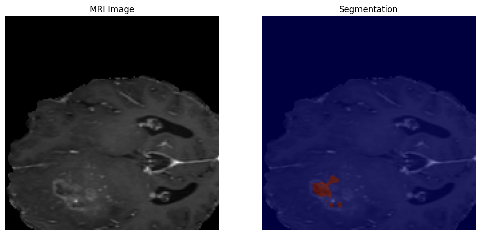
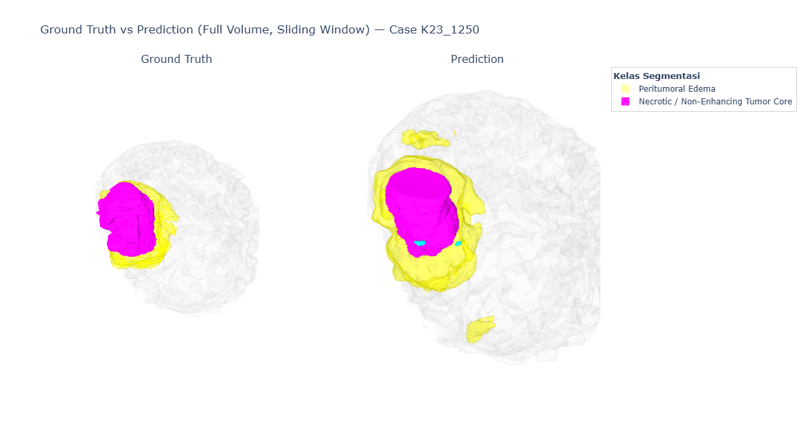

# RSU²-Net+ dengan Mekanisme Attention untuk Segmentasi Tumor Otak 3D

Optimisasi arsitektur RSU²-Net untuk segmentasi tumor otak multi-kelas pada citra MRI 3D, menggunakan metode Taguchi (orthogonal array L16) untuk menentukan konfigurasi hyperparameter dan mekanisme attention terbaik. Dataset: **BraTS 2023**.

---

## 📋 Daftar Isi

- [Ringkasan Proyek](#ringkasan-proyek)
- [Arsitektur Model](#arsitektur-model)
- [Dataset](#dataset)
- [Metodologi Eksperimen](#metodologi-eksperimen)
- [Hasil Eksperimen Taguchi (Screening)](#hasil-eksperimen-taguchi-screening)
- [Hasil Eksperimen Final](#hasil-eksperimen-final)
- [Visualisasi Hasil Segmentasi](#visualisasi-hasil-segmentasi)
- [Struktur Repository](#struktur-repository)
- [Instalasi](#instalasi)
- [Cara Menjalankan](#cara-menjalankan)
- [Referensi](#referensi)

---

## Ringkasan Proyek

Proyek ini mengoptimisasi arsitektur **RSU²-Net** (Residual U-block U²-Net) yang diperkuat dengan mekanisme **attention** untuk segmentasi tiga sub-region tumor otak — *Necrotic Tumor Core* (NETC), *Peritumoral Edema* (ED), dan *Enhancing Tumor* (ET) — dari citra MRI 3D multi-modalitas (T1c, T1n, T2f, T2w).

Tiga faktor dioptimisasi menggunakan **Taguchi orthogonal array L16**:
1. **Learning rate**
2. **Optimizer**
3. **Mekanisme attention** — Additive (Feature) Attention Gate vs. CBAM (Convolutional Block Attention Module)

## Arsitektur Model

Model dibangun di atas backbone **U²-Net** (nested U-structure dengan Residual U-block/RSU), dengan mekanisme attention disisipkan pada setiap *skip connection* sebelum proses *concatenation* ke decoder.

| Komponen | Detail |
|---|---|
| Backbone | U²-Net (RSU_L + RSU_4F blocks) |
| Attention | Additive (Feature) Attention Gate (Oktay et al., 2018) atau CBAM (Woo et al., 2018) |
| Input shape | `(4, 160, 160, 16)` — channels-first |
| Output | 3 kelas, aktivasi sigmoid (multilabel independen) |
| Deep supervision | 5 output level, digabung di akhir |
| Framework | TensorFlow / Keras |

Detail lengkap posisi mekanisme attention dan validasinya terhadap literatur (Oktay et al. 2018; Zhang et al. 2020; Wang et al. 2022) didokumentasikan di `docs/`.

## Dataset

- **BraTS 2023** (nnU-Net v1 format), 1251 kasus total.
- 4 modalitas MRI: T1c, T1n, T2f (FLAIR), T2w.
- 3 kelas tumor: Necrotic Tumor Core, Peritumoral Edema, Enhancing Tumor.
- Preprocessing: patch-based sampling (`160×160×16`), z-score standarisasi per-patch, filter `background_threshold` untuk memastikan representasi tumor yang cukup di tiap patch.

> **Catatan penting soal label:** urutan channel output model (`0, 1, 2`) berkorespondensi dengan label `1 (NETC), 2 (Edema), 3 (ET)` sesuai `dataset.json`. Urutan ini divalidasi eksplisit terhadap kode preprocessing untuk mencegah kesalahan pemetaan label pada tahap evaluasi.

## Metodologi Eksperimen

Eksperimen dilakukan dalam dua tahap:

1. **Tahap screening (Taguchi L16)** — menjalankan 16 kombinasi faktor pada subset data kecil untuk efisiensi komputasi, guna mengidentifikasi konfigurasi paling menjanjikan.
2. **Tahap final** — konfigurasi terbaik dari hasil screening dilatih ulang secara penuh pada seluruh dataset.

### Pengaturan Default — Tahap Screening

| Parameter | Nilai |
|---|---|
| Jumlah data | 10% dari total dataset |
| Versi dataset | BraTS 2023 |
| Epoch | 10 |

## Hasil Eksperimen Taguchi (Screening)

16 konfigurasi diuji berdasarkan kombinasi *learning rate*, *optimizer*, dan mekanisme *attention*, mengikuti orthogonal array L16. Metrik evaluasi: **Dice Coefficient**.

| No | Learning Rate | Optimizer | Attention | Dice Score | Notebook |
|---|---|---|---|---|---|
| L1  | 0.001    | Adam   | Feature Attention | 0.3437 | [`L1_CBAM_RSU2NET.ipynb`](notebooks/01_taguchi_screening/L1_CBAM_RSU2NET.ipynb) |
| L2  | 0.001    | Adamax | Feature Attention | 0.4705 | [`L2_CBAM_RSU2NET.ipynb`](notebooks/01_taguchi_screening/L2_CBAM_RSU2NET.ipynb) |
| L3  | 0.001    | AdamW  | CBAM               | 0.0377 | [`L3_CBAM_RSU2NET.ipynb`](notebooks/01_taguchi_screening/L3_CBAM_RSU2NET.ipynb) |
| L4  | 0.001    | SGD    | CBAM               | 0.3584 | [`L4_CBAM_RSU2NET.ipynb`](notebooks/01_taguchi_screening/L4_CBAM_RSU2NET.ipynb) |
| L5  | 0.0001   | Adam   | Feature Attention | 0.4160 | [`L5_CBAM_RSU2NET.ipynb`](notebooks/01_taguchi_screening/L5_CBAM_RSU2NET.ipynb) |
| **L6**  | **0.0001**   | **Adamax** | **Feature Attention** | **0.5989** ⭐ | [`L6_CBAM_RSU2NET.ipynb`](notebooks/01_taguchi_screening/L6_CBAM_RSU2NET.ipynb) |
| L7  | 0.0001   | AdamW  | CBAM               | 0.5471 | [`L7_CBAM_RSU2NET.ipynb`](notebooks/01_taguchi_screening/L7_CBAM_RSU2NET.ipynb) |
| L8  | 0.0001   | SGD    | CBAM               | 0.0349 | [`L8_CBAM_RSU2NET.ipynb`](notebooks/01_taguchi_screening/L8_CBAM_RSU2NET.ipynb) |
| L9  | 0.00001  | Adam   | CBAM               | 0.5093 | [`L9_CBAM_RSU2NET.ipynb`](notebooks/01_taguchi_screening/L9_CBAM_RSU2NET.ipynb) |
| L10 | 0.00001  | Adamax | CBAM               | 0.3951 | [`L10_CBAM_RSU2NET.ipynb`](notebooks/01_taguchi_screening/L10_CBAM_RSU2NET.ipynb) |
| L11 | 0.00001  | AdamW  | Feature Attention | 0.5530 | [`L11_CBAM_RSU2NET.ipynb`](notebooks/01_taguchi_screening/L11_CBAM_RSU2NET.ipynb) |
| L12 | 0.00001  | SGD    | Feature Attention | 0.0459 | [`L12_CBAM_RSU2NET.ipynb`](notebooks/01_taguchi_screening/L12_CBAM_RSU2NET.ipynb) |
| L13 | 0.000001 | Adam   | CBAM               | 0.2764 | [`L13_CBAM_RSU2NET.ipynb`](notebooks/01_taguchi_screening/L13_CBAM_RSU2NET.ipynb) |
| L14 | 0.000001 | Adamax | CBAM               | 0.1719 | [`L14_CBAM_RSU2NET.ipynb`](notebooks/01_taguchi_screening/L14_CBAM_RSU2NET.ipynb) |
| L15 | 0.000001 | AdamW  | Feature Attention | 0.0328 | [`L15_CBAM_RSU2NET.ipynb`](notebooks/01_taguchi_screening/L15_CBAM_RSU2NET.ipynb) |
| L16 | 0.000001 | SGD    | Feature Attention | 0.0326 | [`L16_CBAM_RSU2NET.ipynb`](notebooks/01_taguchi_screening/L16_CBAM_RSU2NET.ipynb) |

**Konfigurasi terbaik: L6** — *Learning Rate* 0.0001, *Optimizer* Adamax, *Feature (Additive) Attention* — Dice Coefficient **0.5989**, konfigurasi tertinggi di antara seluruh kombinasi yang diuji.

## Hasil Eksperimen Final

Konfigurasi terbaik (L6) dilatih ulang dengan **100% dataset** dan **35 epoch**.

**Evaluasi keseluruhan (rata-rata):**

| Metrik | Nilai |
|---|---|
| Dice Coefficient | 0.7665 |
| Mean IoU | 0.6895 |
| Recall | 66.79% |
| Specificity | 99.74% |

**Evaluasi per kelas (Recall / Specificity):**

| Kelas | Recall | Specificity |
|---|---|---|
| Peritumoral Edema | 0.8351 | 0.9942 |
| Enhancing Tumor | 0.6791 | 0.9988 |
| Necrotic / Non-Enhancing Tumor Core | 0.4894 | 0.9991 |

Perbandingan dengan penelitian rujukan (RSU U²-Net+, Elvaret & Akbar, 2024) tersedia di `results/`.

## Visualisasi Hasil Segmentasi

### Segmentasi 2D (Slice-level)

MRI asli (kiri) dan hasil overlay segmentasi tumor (kanan) pada satu irisan (*slice*) volume 3D:

### Perbandingan Ground Truth vs Prediksi (3D, Full Volume)

Rekonstruksi 3D menggunakan *sliding window inference* pada volume penuh, dibandingkan antara anotasi ground truth (kiri) dan hasil prediksi model (kanan):

> Model menunjukkan performa yang baik dalam mendeteksi *Peritumoral Edema* (kuning) dan *Necrotic/Non-Enhancing Tumor Core* (magenta), dengan pola over-segmentasi ringan pada kelas Edema dan sedikit false positive pada kelas Enhancing Tumor (cyan) — konsisten dengan metrik recall per kelas yang dilaporkan di atas.

## Struktur Repository
